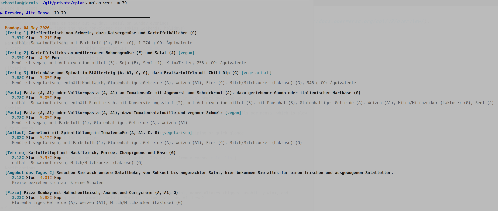

# mplan tooling

A bash script for browsing this week's meals at Dresden mensas, powered by the [OpenMensa API](https://docs.openmensa.org/api/v2/overview/).

## Requirements

- `curl`
- `jq`

Both are available via `apt`:

```bash
sudo apt install curl jq
```

## Installation

```bash
git clone <repo>
cd mplan
sudo ln -s "$PWD/mplan" /usr/local/bin/mplan
```

Or just add the directory to your `PATH`.

## Usage

```
mplan list                       List all mensas near Dresden with their IDs
mplan today [-m ID[,ID,...]]     Show today's meals
mplan week  [-m ID[,ID,...]]     Show this week's meals (Mon–Fri)

Options:
  -m, --mensa ID[,ID,...]   Comma-separated mensa IDs (default: all near Dresden)
```

## Preview



## Examples

List all mensas near Dresden:

```
$ mplan list
200   Dresden, Mensa Brühl               Brühlsche Terrasse 1, 01067 Dresden
86    Dresden, Mensa Stimm-Gabel         Wettiner Platz 13, 01067 Dresden
80    Dresden, Mensa Matrix              Reichenbachstr. 1, 01069 Dresden
...
```

Show today's meals for a specific mensa:

```bash
mplan today -m 80
mplan today -m 80,82
```

Show the full week for all mensas, or filter by ID:

```bash
mplan week
mplan week -m 80
mplan week -m 80,82,79
```

Each meal is shown with its category, name, prices (student / employee / other), and allergen notes.

## Data source

Meal data comes from [OpenMensa](https://openmensa.org), a community-maintained open meal database for German university canteens. The script queries canteens within 20 km of Dresden city center.
